# __잡플래닛 기업 리뷰 분석을 통한 관심 산업 분야 파악__
## 🎈 __수집 데이터: 잡플래닛 기업 한 줄 리뷰 및 별점__
> ### 4가지 산업군에 대한 전체 리뷰 및 별점 스크래핑(공공기관, IT, 금융, 세무·회계 분야)

&nbsp;
## 🎈 __진행 프로젝트__
1. 워드 클라우드: 산업군별 키워드 추출
1. 기타 모델 적용
    * Naive Bayes
    * Logistic Regression
    * ANN
    * K-NN
    * Decision Tree
    * SVM 모델
1. CRF 모델 적용

&nbsp;
## 🎈 __프로젝트 진행 순서__
1. 잡플래닛 사이트 리뷰 및 별점 스크래핑
1. 수집 데이터 특성 추출
    * Soynlp를 이용한 리뷰의 빈도수 상위 명사 추출
    * 추출된 명사 기반의 꼬꼬마 분석기 사전 setting
1. 적용 모델에 따른 데이터 전처리 → 데이터 분석
    * 워드 클라우드
    * 기타 모델 적용
    * CRF 모델 적용
1. 모델 실행 결과 분석

&nbsp;


## __🎈 1단계: [리뷰 스크래핑](https://github.com/sujin421/text-mining-project/blob/da393c3d057268a9c07b21d735427d74ae79db26/1.%20Web%20Scarping.ipynb){:target="_blank"}__
### 기업의 한 줄 리뷰 및 별점 데이터를 딕셔너리 형식으로 `{리뷰: 별점}` 스크래핑

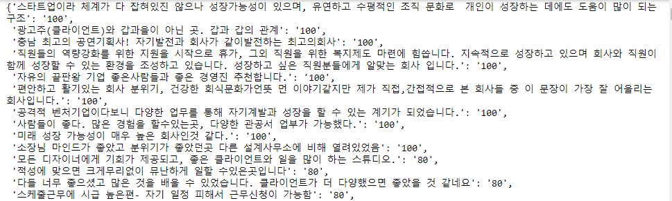


&nbsp;
## 🎈 __2단계: 수집 데이터 특성 추출__
### __1) Soynlp를 이용하여 리뷰의 빈도수 상위 명사 추출__
* 빈도수와 명사 점수를 기준으로 상위 100개 단어를 확인하여
1. '회사', '업무', '기업', '직원' 등 특성 파악에 의미 없는 단어는 불용어 사전에 추가
1. '워라벨(밸)' 같이 빈도수가 높은 단어인데 형태소 분석기가 명사로 인식하지 못하는 단어를 꼬꼬마 분석기 사전에 추가


### __2) 꼬꼬마 분석기 사전 Setting__
* 앞선 명사 추출 결과에 따라 인터넷 리뷰 특성상 꼬꼬마 분석기를 통해 추출할 수 없는 단어(워라밸, 칼퇴 등)을 꼬꼬마 분석기 사전에 추가하여 형태소 분석의 성능 향상 기대
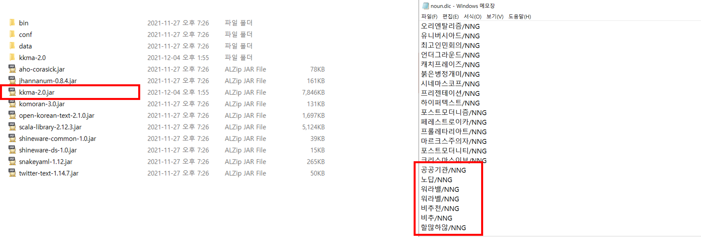

&nbsp;

## __🎈 3단계: 데이터 분석__
## __1. [Word Cloud](https://github.com/sujin421/text-mining-project/blob/11de871e5b9b3d216fc7ed7d1912ec1cf90c29b7/2.%20WordCloud.ipynb){:target="_blank"}__
### 꼬꼬마 분석기를 이용한 형태소 분석을 통해 명사를 추출하여 산업군별 키워드 파악
산업군 | 공공기관 | 금융/은행 | IT | 세무/ 회계
---------- | ---------- | ---------- | ---------- | ---------- |
주요 키워드 | 공공기관, 경험, 공무원, 계약직, 경험, 복지 등 | 연봉, 생각, 성장, 복지, 문화, 추천, 다양 등 | 경험, 추천, 성장, 다양, 개발, 복지, 자유 등 | 회계, 다양, 사무실, 세무, 신입, 세무사, 회계사, 법인 등
Word Cloud |  |  |  | 

&nbsp;
## __2. [기타 모델 적용](https://mybinder.org/v2/gh/sujin421/text-mining-project/da393c3d057268a9c07b21d735427d74ae79db26?filepath=3.%20Review%20Classification(CRF%2C%20etc.).ipynb){:target="_blank"}__
### 수업 시간에 다룬 Review Classification(영화 리뷰 감성 분류) 기반 긍정/부정 리뷰의 빈도수를 활용하여 6가지 모델로 학습 후 결과 확인
### __1) 데이터 전처리__
* POS tag 중 ‘E’(어미), ‘J’(조사), ‘S’(부호 외래어)로 시작하는 token 제거
* POS 제거 후 token의 빈도수를 확인하여 긍정/부정 판단이 어려운 중의적 단어와 무의미한 단어를 `불용어 사전`으로 정의  

* 지프의 법칙 확인  

전처리 전 token 빈도수 | 전처리 후 token 빈도수
--------------------- | ---------------------
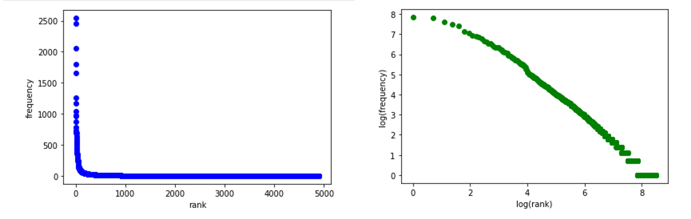 | 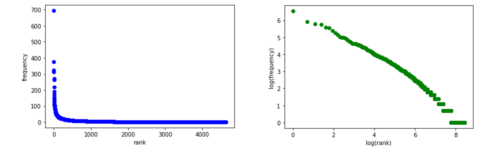
* 빈도수 2이하의 token 삭제

### __2) 데이터 분석 결과__
* X(입력: review), y(결과: score)로 정의하여 학습 및 분석 실행
* Precision이 약 0.4~0.5 수준을 보임

Naive Bayes  | Logistic Regression  | ANN  
------------ | -------------------- | ----
 |   |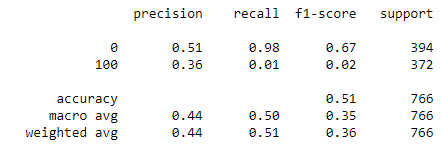  

K-NN  | Decision Tree  | SVM 모델
----- | -------------- | --------
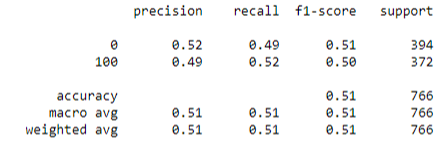 | 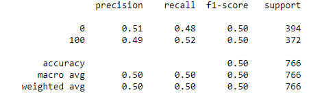 | 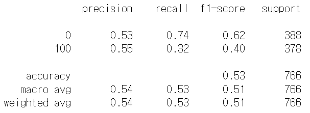 

&nbsp;
## __3. CRF 모델 적용__
### 기타 모델 적용 결과, 점수가 높지 않아 CRF 모델 적용
### __1) 불용어 사전 및 긍정/부정어 사전 정의__
* 문서 전체에 포진되어 있어 리뷰 점수에 영향을 미치지 않는 불용어 선언


* 꼬꼬마 분석기로 리뷰의 형태소 분석을 진행하여 `1) 불용어가 아니며, 2) 체언, 관형사, 부사`에 해당하면 해당 리뷰와 함께 리스트에 저장
* 리뷰 점수가 평균 이상이면 긍정 단어, 평균 이하이면 부정 단어로 분류하여 긍정/부정 단어사전 제작
* (위) 긍정 단어사전 | (아래)부정 단어사전  
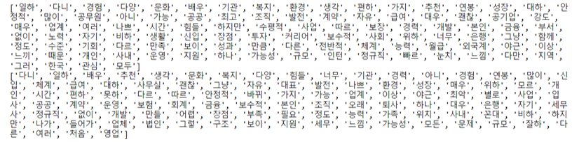

### __2) 데이터 전처리__
* POS tag 중 ‘E’(어미), ‘J’(조사), ‘S’(부호 외래어)로 시작하는 token 제거

### __3) 외부의 긍정/부정어 사전 이용__
* 외부의 감정 사전을 CRF Features로 이용  
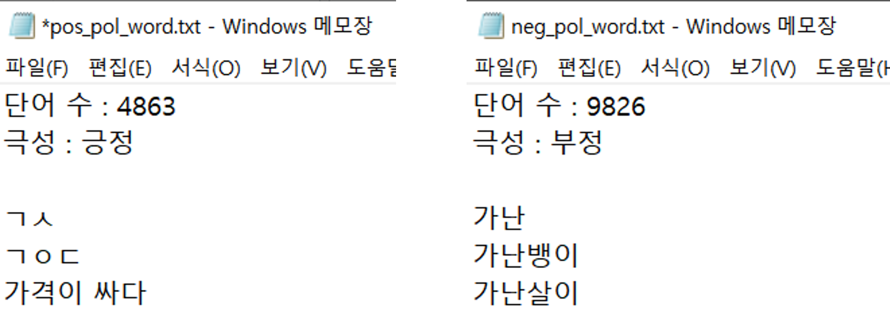

### __4) CRF 모델 정의__
* CRF Features 정의
    * 직전 단어와 2개 전 단어, 다음 단어와 2개 뒤 단어에도 동일 features 적용
```Python
    features = {
        'bias': 1.0, # token에 기본값 1
        'postag': postag, # POS tag
        'postag[:2]': postag[:2], # POS tag
        'dic_text_pos' : True if word in dic_text_pos1 else False, # 직접 추출한 긍정/부정 사전
        'dic_text_neg' : True if word in dic_text_neg1 else False, # 직접 추출한 긍정/부정 사전
        'dict_pos' : True if word in dict_pos else False, # 외부 긍정/부정 사전
        'dict_neg' : True if word in dict_neg else False, # 외부 긍정/부정 사전
        'word.len' : len(word) # 단어 길이
    }
```
   
* Sentence 적용 함수 정의
    * Sentence to features 함수, Sentence to score 함수, Sentence to tokens 함수 정의
    * X: sentence의 features, Y: sentence의 score

* CRF 모델 생성
    * C1의 가중치를 0.1, 1, 2, 3, 5, 10로 적용 결과 2가 가장 성능이 좋아 2로 적용
    * 데이터의 70%에 해당하는 sentenc를 CRF model에 fitting
    * Cross validation 5로 적용(5개의 train-test model 생성 후 평균)

* __Evaluation__  
    __✏ 유의미한 차이를 보이진 않으나, 7가지 학습 모델 중 CRF의 precision이 가장 높게 나옴__  
    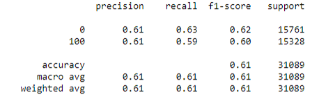  

* __Features별 weigth 확인__  
    __✏ 리뷰에서 추출하여 직접 만든 긍정/부정어 사전이 가장 높은 weight를 가지는 것을 알 수 있음__ 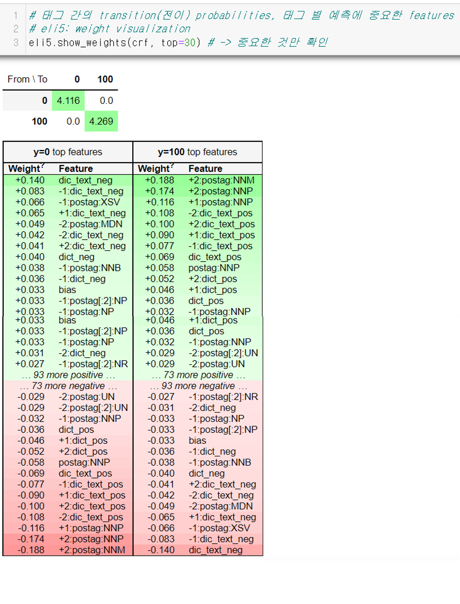  

## __🎈 4단계: 모델 실행 결과 분석__
### __1) 분석 대상의 특성 및 전처리, 적용한 속성에 따라 기대보다 낮은 예측치 산출__
* 리뷰의 평균 점수를 기준으로 긍정은 100점, 부정은 0점으로 이분화하여 classification을 수행하였으나, 리뷰 점수의 평균치 근방에 점수의 분포가 몰려 있어 성능 하락을 보일 수 밖에 없음.
* ANN model의 경우, '100'score의 recall이 0이 나오는 문제점이 있어 alpha와 hidden layer size를 조정해주었음.
### __2) 한국어의 특질에 따른 한계점__
* 한국어의 특성상 앞뒤의 단어 및 접두사, 접미사에 따라 의미가 크게 변화하는데, (e.g. 분위기 좋음, 분위기 나쁨) N-gram을 사용하지 않았기 때문에 해당 단어의 긍정과 부정을 판별하기 어려움
* 또한, 부정 리뷰에서 사용되었을 수 있는 반어법을 검증하기 어렵고 한국어는 맞춤법을 지키지 않고 소리나는 대로 표현하여도 뜻이 통하기 때문에 이를 학습 모델이 판별하기 어려움
### __3) 발전 및 개선 방향__
* Classification 수행 시 리뷰 점수 평균치를 기준으로 분류하는 것이 아닌 중간 점수의 리뷰를 제외하고 점수가 아주 높고 아주 낮은 리뷰에서 빈도수 상위 단어를 추출하여 긍정/부정 단어 사전으로 활용하여 한계 극복
* CRF 모델 수행 시 잡플래닛 외에 사람인 등 다른 사이트의 정보에 적용해도 일반적으로 통용될 수 있는  features를 추가하여 성능 향상 기대
* 기타 모델에 비해 CRF의 정확도가 다소 높았지만, 80% 이상의 높은 정확도 확보를 위해 분류 기준을 다양하게 시도해 볼 필요가 있음(class 3개 이상, score 외 다른 정보 이용)
* 이번 프로젝트에서 시행한 분석 방법 외에 직군별 주요 리뷰 요약(summarization) 시도해볼 만함.
* 재직자의 리뷰가 갖는 특성을 살려 공개되어 있는 공시 정보 외의 일상적, 사적 정부를 얻을 경우 더 유의미하고 가치 있는 정보가 될 것임.


